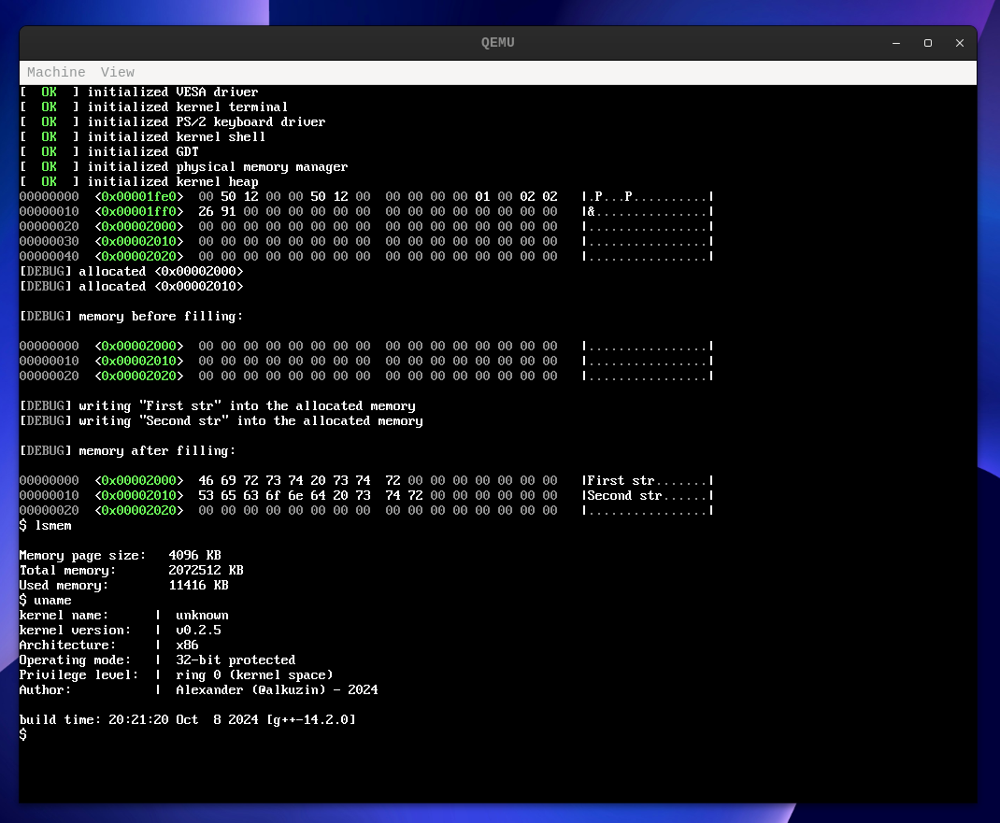
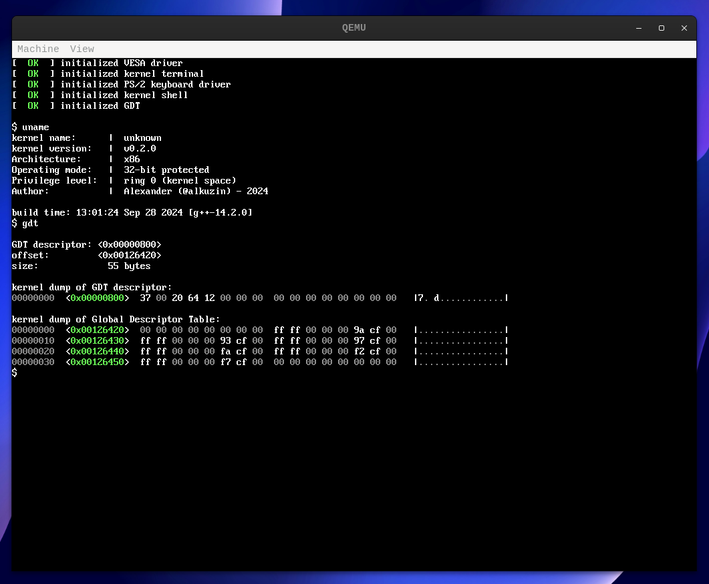

# Kernel From Scratch changes

## release v0.2.5

* fix: fixed issue with overwriting pages
* refactor: added `_KB` suffix & replaced `printk` with `panic`
* feat: added kernel `panic()`
* feat: added `KERN_EMERG`
* feat: added `ksize()`
* feat: added `kfree()`
* feat: added `kmalloc()`
* feat: added kernel.hpp
* feat: added `SLAB` allocator
* feat: added KB literal
* feat: added `strncpy` function
* feat: added `log()` & `log2()` functions
* fix: fixed issue with overwriting kernel data
* refactor: added stack support
* fix: fixed memory map size
* feat: added `memory map` to store pages
* feat: added memory management types
* refactor: added memory allocation flags
* refactor: added memory start physical address
* refactor: set some variables as inline const
* feat: added `capacity()` method
* feat: added common bit operations
* refactor: added `asmlinkage` macro
* refactor: removed kernel config file
* feat: added `lsmem` kernel shell command
* feat: added `free_pages()` method
* feat: added `alloc_pages()` & `get_free_pages()` methods
* feat: added `bits_per_element()` method
* fix: fixed issue with bitmap initialization
* feat: added `phys_addr_t` type
* feat: initialized `physical memory manager`
* refactor: small changed
* feat: adde kernel `memory layout`
* feat: added `bitmap` structure

## release v0.2.0

* refactor: renamed types header file & removed extra spaces
* refactor: moved some files to `common/` directory
* fix: fixed issue with displaying multiple formats in a row
* feat: added `isalpha()` & `isalnum()` functions
* feat: added kernel `config`
* feat: added kernel `log`
* feat: added `putk()` function
* refactor: changed default colors
* feat: added colored text for kernel dump
* feat: added shell `clear` command
* feat: added colored `printk()` function
* feat: added `ring()` & `mode()` functions
* feat: added `gdt` command to shell
* feat: added kernel `memory dump` function
* feat: updated `vsnprintk()`
* feat: added `isdigit()` & `isspace()` functions
* feat: added debug `esp()` & `ebp()` functions
* feat: added kernel `halt` function
* feat: added simple `shell`
* feat: added `strncmp()` function
* feat: added kernel `boot` function
* feat: added `keyboard`
* feat: added `inb()`
* feat: set Global Descriptor Table to `0x00000800`
* feat: added `Global Descriptor Table`

## release v0.1.0

* docs: added short description
* fix:  fixed issue with displaying of character
* feat: added `printk()`
* feat: added `vsnprintk()` & `putchar()`
* feat: added `cstdarg` macros
* feat: added `log()` math function
* feat: added `isupper()` function
* feat: added kernel `terminal`
* feat: added kernel `RGB` colors
* feat: added `cctype`
* feat: added `cstring`
* feat: added `draw_char` method
* feat: added `font`
* feat: added `VESA` driver
* feat: added kernel `types`
* feat: added `multiboot`
* feat: booted simple kernel
* Initial commit
