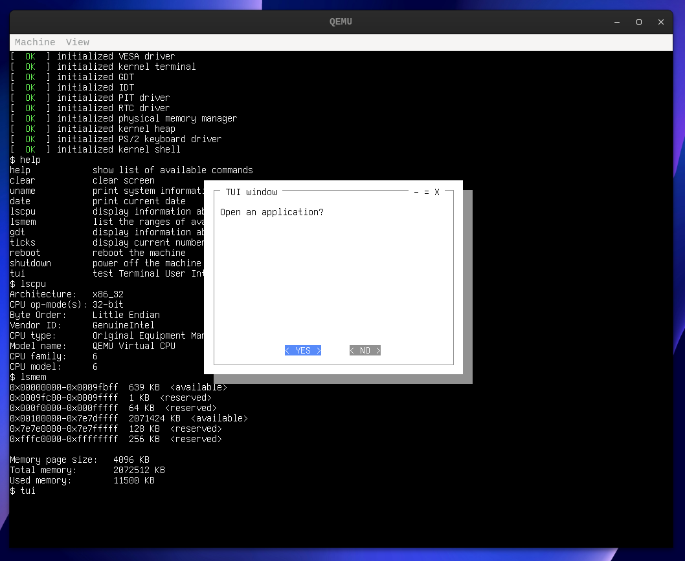
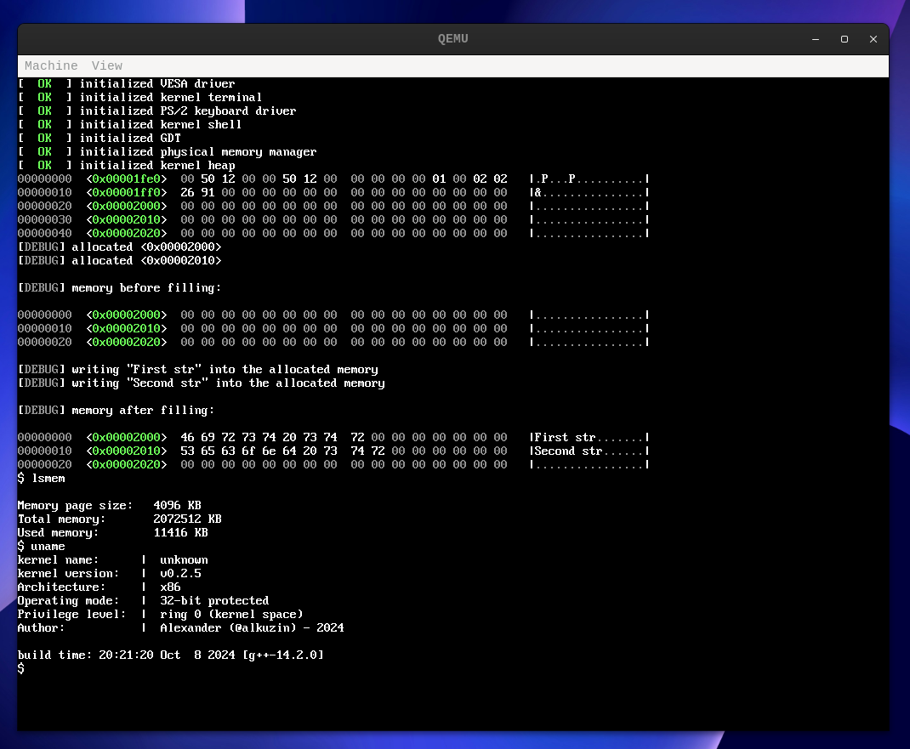
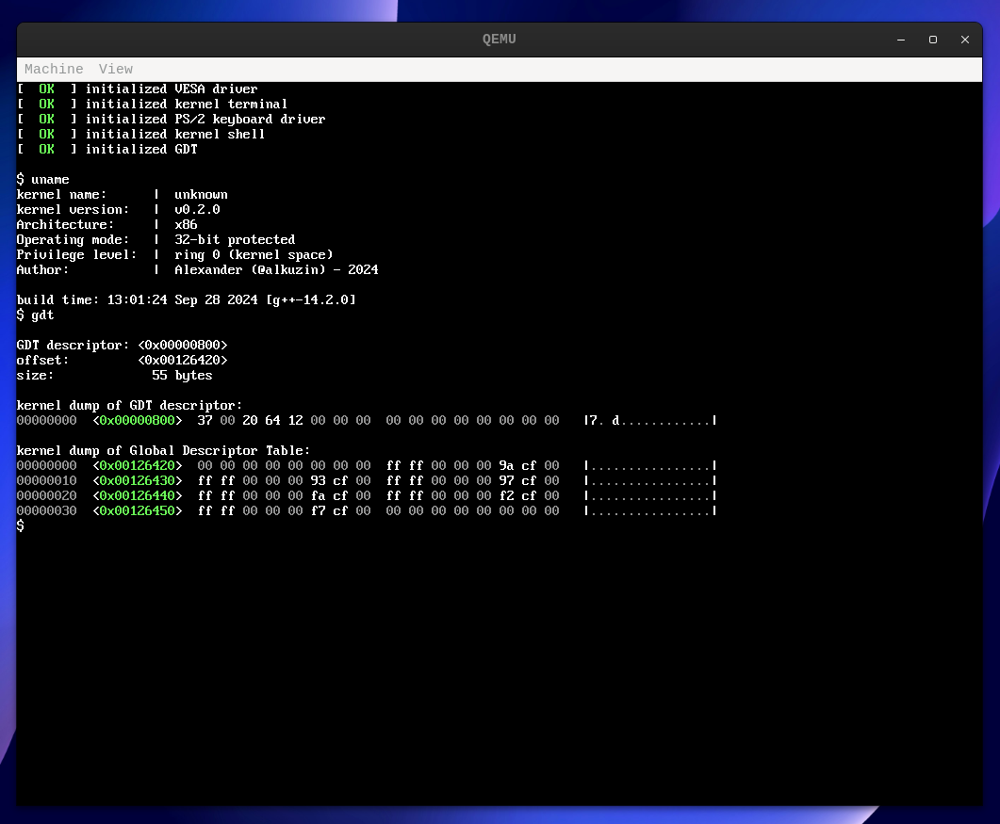

# Kernel From Scratch changes

## release v0.3.5

|Language                   | files      |   blank      | comment|         code |
|---------------------------|------------|--------------|--------|------------- |
|C++                        |    26      |     866      |     874|         3429 |
|C/C++ Header               |    41      |     539      |    1701|         1270 |
|Assembly                   |     3      |      39      |      54|          176 |
|SUM:                       |    70      |    1444      |    2629|         4875 |

| Total lines | Size (with debug symbols) | Pure size           |
|-------------|---------------------------|---------------------|
| 8948        | 188644 bytes (185 KB)     | 46760 bytes (46 KB) |

* refactor: removed `display_general()` & `display_build()` functions
* feat: added `tui` shell builtin command
* feat: added support for TUI `buttons`
* feat: added `getch()` function
* feat: added `TUI`
* feat: added `abs()` function
* fix: fixed issue with executing incomplete command
* feat: added `reboot` & `shutdown` shell builtin commands
* feat: added `outw()` function
* refactor: separated shell & builtins
* feat: added shell `command autocompletion`
* feat: added `TAB` key handler
* feat: added `strlen()` function
* refactor: removed `m_` prefix
* refactor: moved `current_space()` function
* refactor: replaced some functions with `get_register()`
* refactor: replaced struct `pic_t` with namespace
* refactor: updated font
* feat: added `lscpu` shell builtin command
* feat: added `CPU info` gathering functions
* feat: added `memcpy()` function
* fix: fixed issue with overwriting multiboot info structure
* refactor: restructured kernel shell
* refactor: restructured physical memory manager
* feat: added `display_memory()` function
* refactor: changed `TTY` structure
* refactor: changed `VESA driver` structure
* refactor: replaced `keyboard` struct with namespace
* refactor: added `ktime` namespace for some declarations
* feat: added `ticks` shell builtin command
* feat: added `ktime::get()` function
* feat: added `Programmable Interval Timer` (PIT)
* feat: added `date` shell builtin command
* feat: added kernel time handeling functions
* feat: added `Real-Time Clock` (RTC)
* feat: added `snprintk()` function
* feat: added `set_register()` function
* feat: added `pid_t` type

## release v0.3.0

|Language          |          files   |      blank     |  comment |         code|
|------------------|------------------|----------------|----------|-------------|
|C++               |             19   |        583     |      603 |         2457|
|C/C++ Header      |             34   |        448     |     1373 |         1078|
|Assembly          |              3   |         39     |       54 |          176|
|SUM:              |             56   |       1070     |     2030 |         3711|

| Total lines | Size (with debug symbols) | Pure size           |
|-------------|---------------------------|---------------------|
| 6811        | 141220 bytes (138 KB)     |  34144 bytes (34 KB)|

* feat: added `get_line()` function
* refactor: removed `shell_t::get_line()` function
* feat: added IRQ enumeration
* feat: added `Interrupt Descriptor Table` (IDT)
* feat: added `Interrupt Request` (IRQ)
* feat: added `Programmable Interrupt Controller`
* feat: added `sti() & cli()` functions
* feat: added `outb()` function
* feat: added GDT segments offsets
* fix: fixed issue with setting `mem_map`
* feat: added `get_register()` function
* feat: added `MB` and `GB` literals
* feat: added some bit handeling functions

## release v0.2.5

|Language        |            files   |      blank   |    comment |         code|
|----------------|--------------------|--------------|------------|-------------|
|C++             |               15   |        534   |        495 |         2235|
|C/C++ Header    |               30   |        392   |       1205 |          878|
|Assembly        |                2   |         18   |         39 |           50|
|SUM:            |               47   |        944   |       1739 |         3163|

| Total lines | Size (with debug symbols) | Pure size           |
|-------------|---------------------------|---------------------|
| 5846        | 119000 bytes (117 KB)     | 33928 bytes (34 KB) |

* fix: fixed issue with overwriting pages
* refactor: added `_KB` suffix & replaced `printk` with `panic`
* feat: added kernel `panic()`
* feat: added `KERN_EMERG`
* feat: added `ksize()`
* feat: added `kfree()`
* feat: added `kmalloc()`
* feat: added kernel.hpp
* feat: added `SLAB` allocator
* feat: added KB literal
* feat: added `strncpy` function
* feat: added `log()` & `log2()` functions
* fix: fixed issue with overwriting kernel data
* refactor: added stack support
* fix: fixed memory map size
* feat: added `memory map` to store pages
* feat: added memory management types
* refactor: added memory allocation flags
* refactor: added memory start physical address
* refactor: set some variables as inline const
* feat: added `capacity()` method
* feat: added common bit operations
* refactor: added `asmlinkage` macro
* refactor: removed kernel config file
* feat: added `lsmem` kernel shell command
* feat: added `free_pages()` method
* feat: added `alloc_pages()` & `get_free_pages()` methods
* feat: added `bits_per_element()` method
* fix: fixed issue with bitmap initialization
* feat: added `phys_addr_t` type
* feat: initialized `physical memory manager`
* refactor: small changed
* feat: adde kernel `memory layout`
* feat: added `bitmap` structure

## release v0.2.0

|Language         |           files    |     blank    |   comment     |     code|
|-----------------|--------------------|--------------|---------------|---------|
|C++              |              13    |       396    |       409     |     1791|
|C/C++ Header     |              20    |       255    |       755     |      592|
|Assembly         |               2    |        19    |        39     |       49|
|SUM:             |              35    |       670    |      1203     |     2432|

| Total lines | Size (with debug symbols) | Pure size           |
|-------------|---------------------------|---------------------|
| 4305        | 81680 bytes (80 KB)       | 25272 bytes (25 KB) |

* refactor: renamed types header file & removed extra spaces
* refactor: moved some files to `common/` directory
* fix: fixed issue with displaying multiple formats in a row
* feat: added `isalpha()` & `isalnum()` functions
* feat: added kernel `config`
* feat: added kernel `log`
* feat: added `putk()` function
* refactor: changed default colors
* feat: added colored text for kernel dump
* feat: added shell `clear` command
* feat: added colored `printk()` function
* feat: added `ring()` & `mode()` functions
* feat: added `gdt` command to shell
* feat: added kernel `memory dump` function
* feat: updated `vsnprintk()`
* feat: added `isdigit()` & `isspace()` functions
* feat: added debug `esp()` & `ebp()` functions
* feat: added kernel `halt` function
* feat: added simple `shell`
* feat: added `strncmp()` function
* feat: added kernel `boot` function
* feat: added `keyboard`
* feat: added `inb()`
* feat: set Global Descriptor Table to `0x00000800`
* feat: added `Global Descriptor Table`

## release v0.1.0

| Language     |               files |        blank |      comment |         code |
| -------------|---------------------|--------------|--------------|--------------|
| C++          |                   8 |          283 |          258 |         1369 |
| C/C++ Header |                  12 |          156 |          457 |          338 |
| Assembly     |                   1 |           13 |           23 |           36 |
| SUM:         |                  21 |          452 |          738 |         1743 |

| Total lines | Size (with debug symbols) | Pure size           |
|-------------|---------------------------|---------------------|
| 2933        | -     | - |

* docs: added short description
* fix:  fixed issue with displaying of character
* feat: added `printk()`
* feat: added `vsnprintk()` & `putchar()`
* feat: added `cstdarg` macros
* feat: added `log()` math function
* feat: added `isupper()` function
* feat: added kernel `terminal`
* feat: added kernel `RGB` colors
* feat: added `cctype`
* feat: added `cstring`
* feat: added `draw_char` method
* feat: added `font`
* feat: added `VESA` driver
* feat: added kernel `types`
* feat: added `multiboot`
* feat: booted simple kernel
* Initial commit